**[DAO-Manager-JS](./package/)**

**[DAO-Manager-JS Application](./app/)**

**[Demo application](https://dao-manager-js.vercel.app/)**

# About **DAO-Manager-JS**

**DAO-Manager-JS** is a library designed for easy interaction with DAOs on the NEAR blockchain. It provides the ability to interact with DAOs without delving into the details. Using this library, developers will not have to spend time figuring out how to interact with a blockchain or DAO implementation. The foundation of the library is **[Sputnik DAO](https://github.com/near-daos/sputnik-dao-contract)**.

## Interaction with the **Library**

To start using the library, you need to install all dependencies. For example:

```bash
yarn install
```

After installing all dependencies, the library must be compiled. For example:

```bash
yarn run build
```

In your application, include it as follows in the package.json file:

```json
"dao-manager-js-lib": "file:../dist",
```

Now, you can proceed with coding:

First, you need to get the library instance.

```javascript
const daoManagerInstance = DaoManagerJS.getInstance();
```

After that, you will need to log in. At the moment authorisation via MyNearWallet is available. If you have not interacted with MyNearWallet before you can go to the following link. **[MyNearWallet](https://www.mynearwallet.com/)**

```javascript
await daoManagerInstance.createConnection({
  networkID: NetworkID.testnet,
  connectionType: ConnectionType.wallet,
});

await daoManagerInstance.logIn({
  successUrl: "https://www.exampleSuccessURL",
  failureUrl: "https://www.exampleFailURL",
});
```

After that we can call functions to interact with DAO, for example, let's create a DAO.

```javascript
const result = await daoManager.createDaoManager({
  deposit: "6",
  metadata: JSON.stringify({ iconImage: "Image base64 format" }),
  name: "test-dao.testnet",
  policy: ["example.testnet"],
  purpose: "Test purpose",
});
```

For an overview of the available functions in DAO you can follow the link below **[Sputnik DAO](https://github.com/near-daos/sputnik-dao-contract)**.
To learn how to use the DAO-Manager-JS API you can go to the **[DAO-Manager-JS tests](./test//DaoMenegerUnitTest.test.ts)**

# About **DAO-Manager-JS Application**

**DAO-Manager-JS Application** is an application for easy interaction with DAOs on the NEAR blockchain, based on the **DAO-Manager-JS** library. It provides an intuitive interface, allowing users to easily manage DAOs. This web application is fully responsive for desktop and mobile. You can find the following link **[DAO-Manager-JS Application](./app/)**

## Features

With the **DAO-Manager-JS Application**, users can:

- View and manage their DAOs
- Create proposals and vote
- Track activity and changes to their DAO
- Perform transactions and manage membership
- And other DAO features

## Demonstration

Preview demonstration:


Desktop view:

Log in

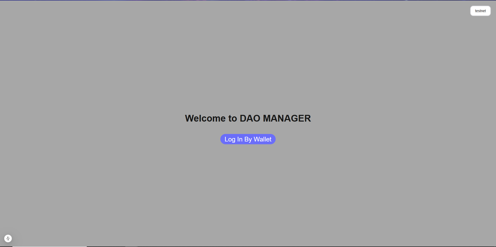

Home page

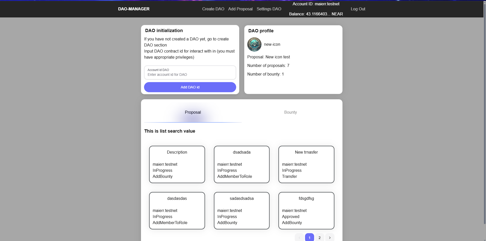

Create DAO

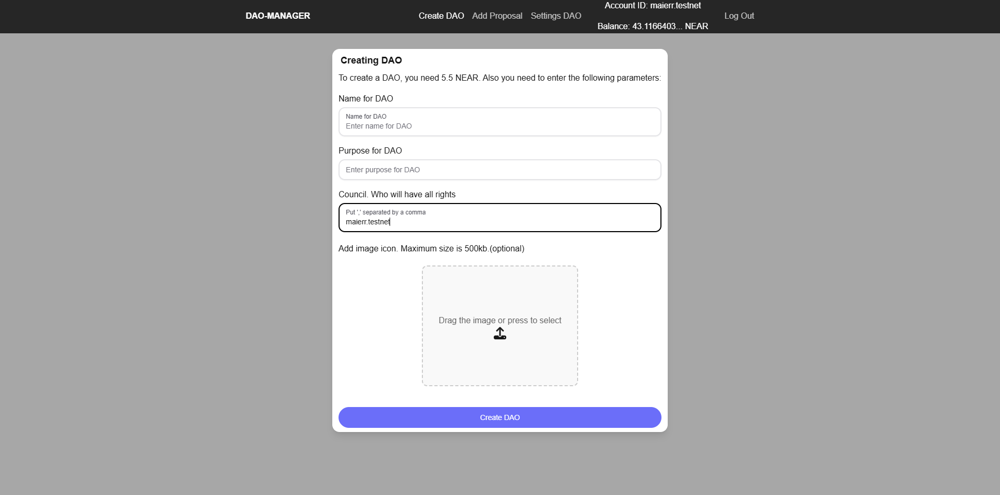

Add Proposal

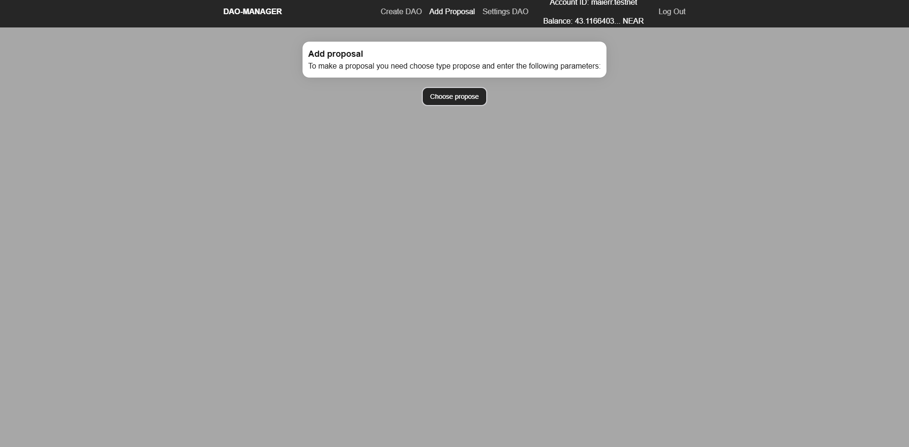

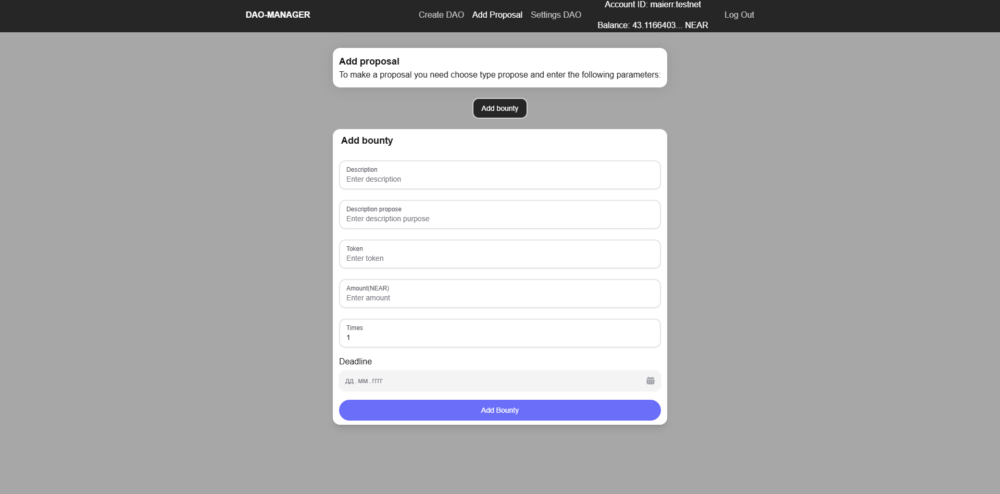

Settings DAO

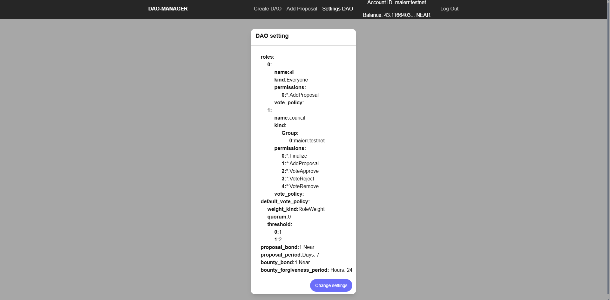

Mobile view:

Log in

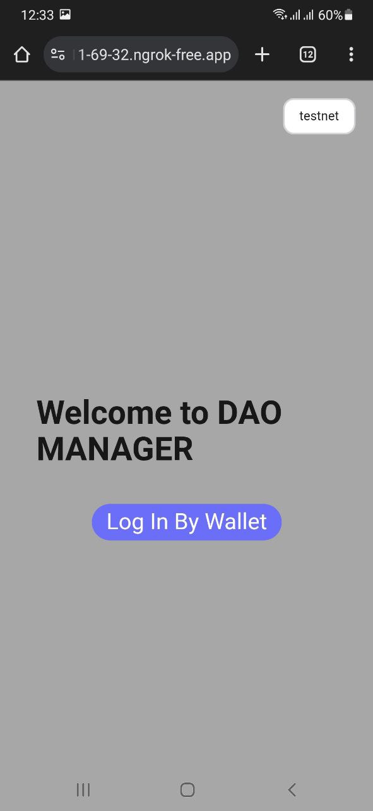

Home page

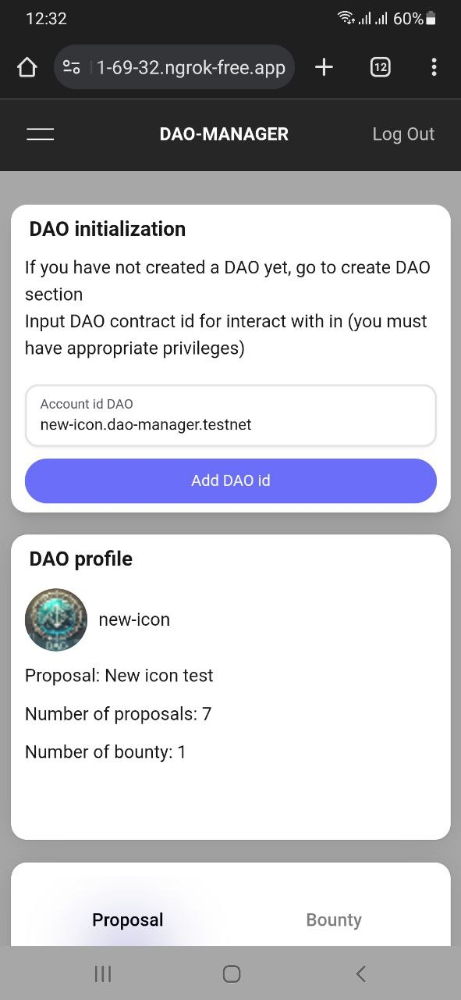

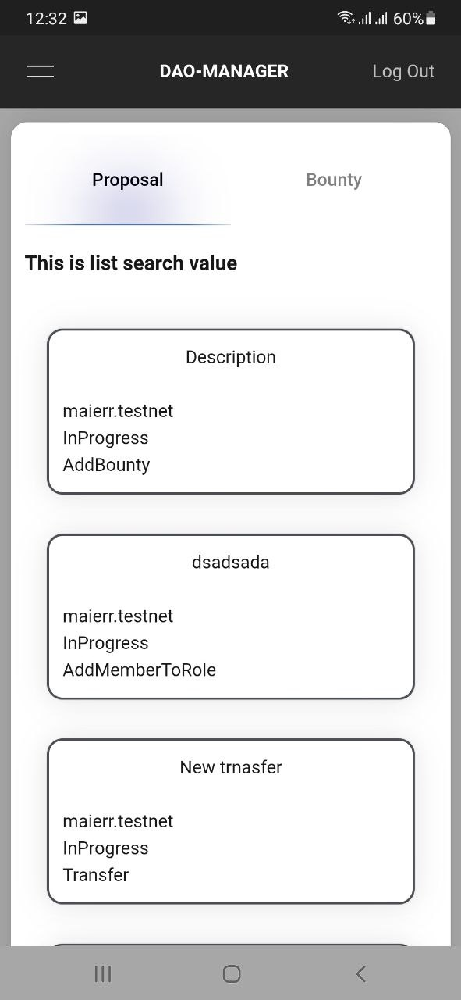

Create DAO

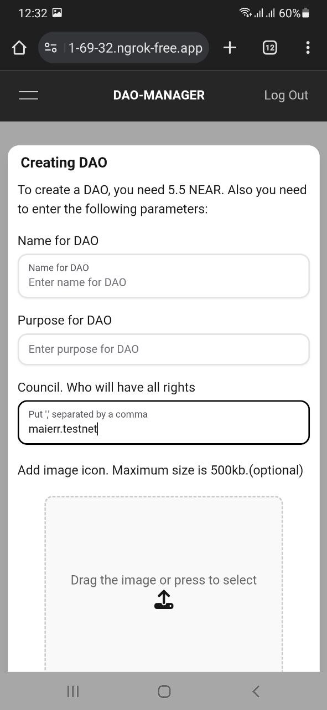

Add Proposal

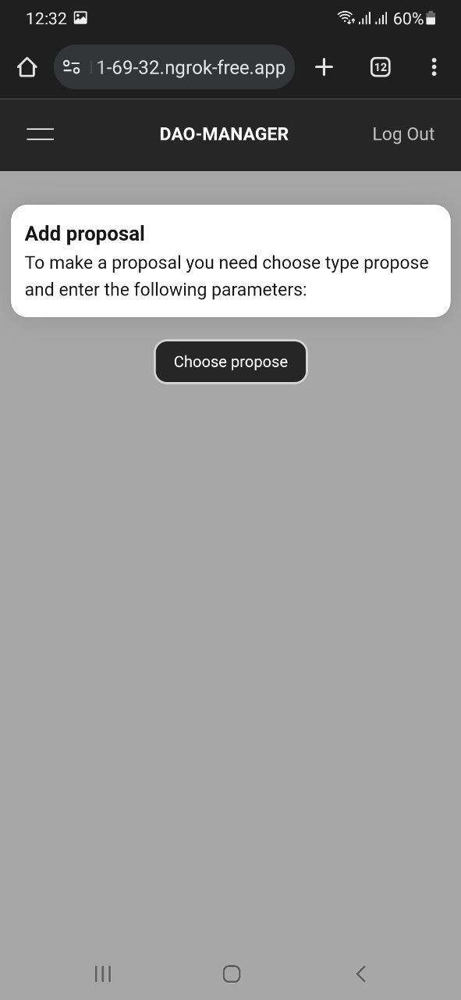

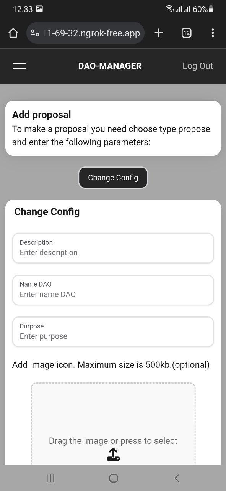

Settings DAO

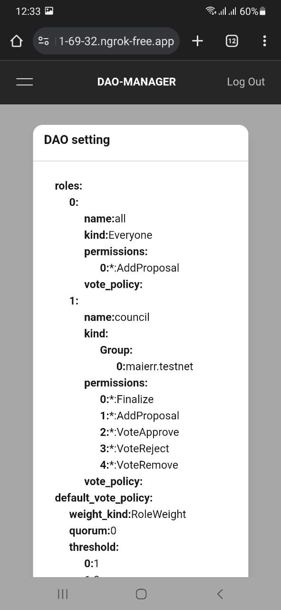

## **Contributing**

Instructions for contributing to this library:

1. Fork this repository.
2. Create a new branch:  
   **`git checkout -b my-new-branch`**
3. Make changes and commit them:  
   **`git commit -m "My message"`**
4. Push to the remote branch:  
   **`git push origin my-new-branch`**
5. Create a pull request.

List any dependencies or prerequisites needed before getting started with editing this library:

- NodeJS
- TypeScript

Instructions for building the library from source code:

1. Clone this repository:  
   **`git clone https://github.com/19Nazar/dao-manager-js`**
2. Navigate to the project root directory:  
   **`cd dao-manager-js`**

